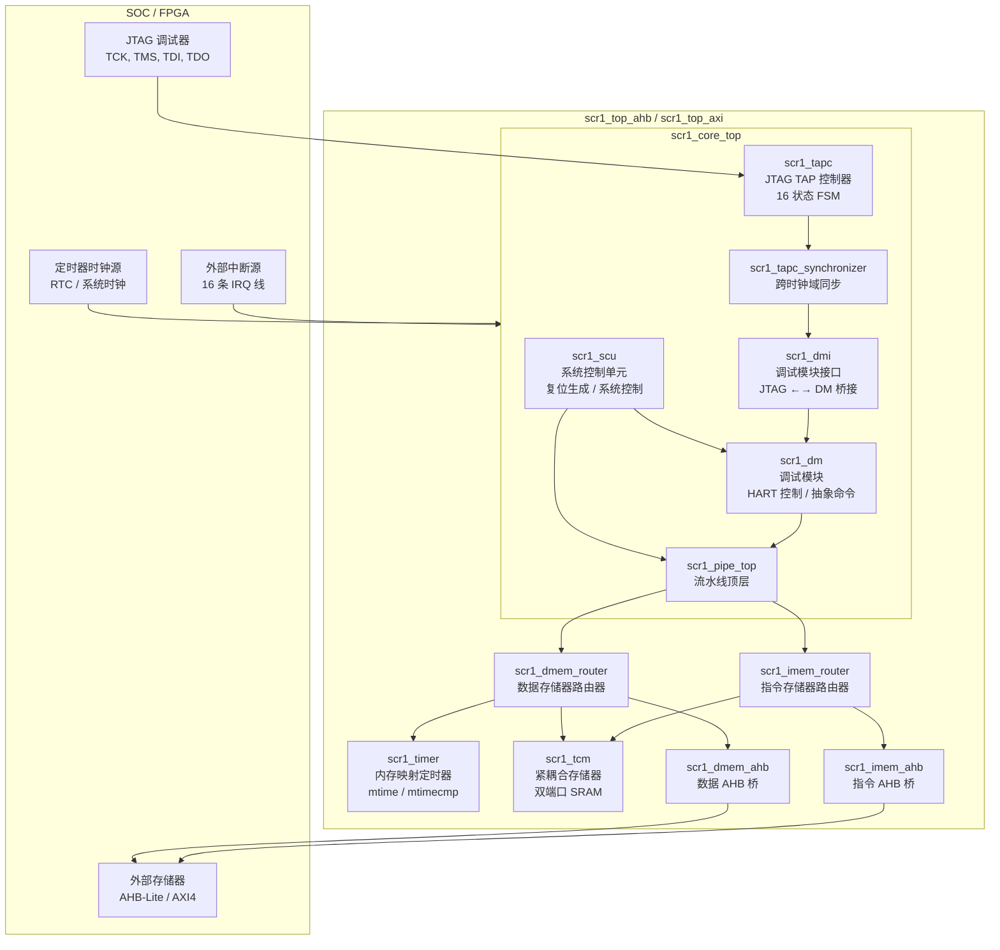
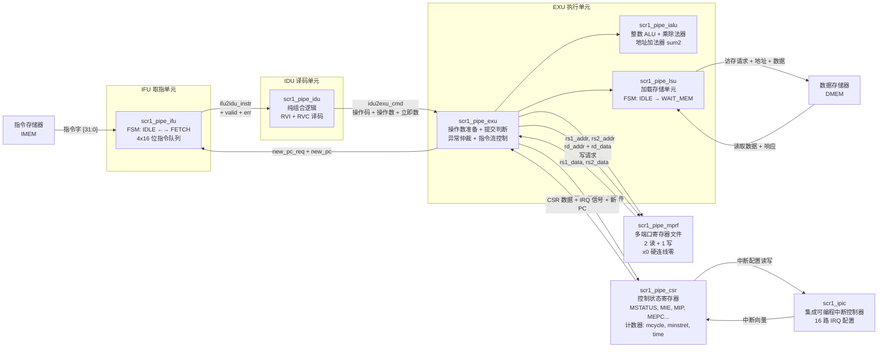
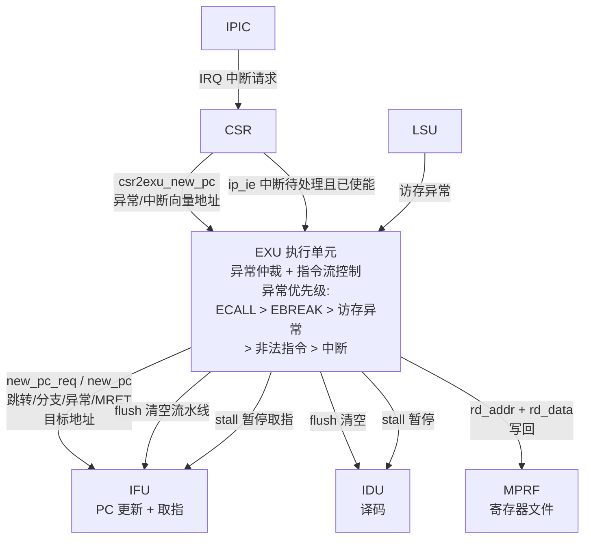
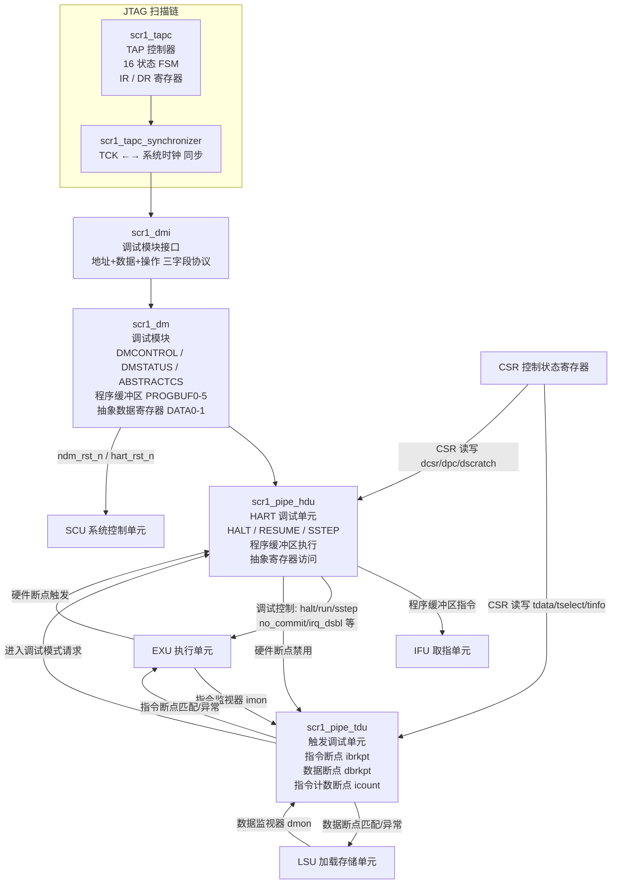
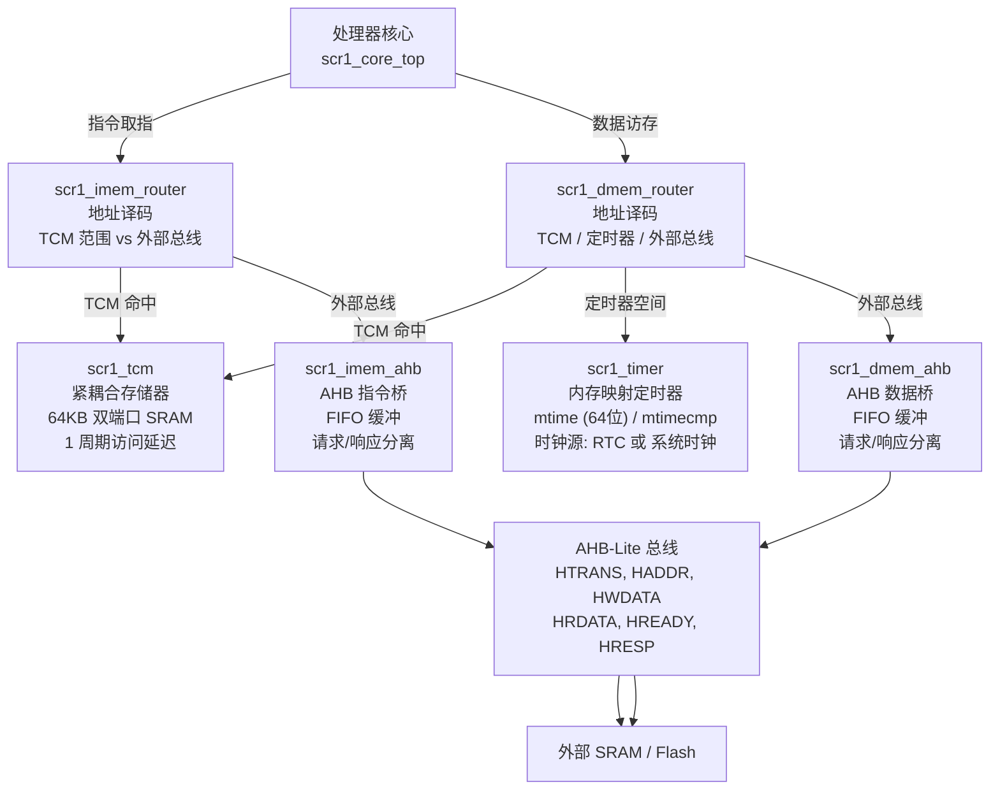
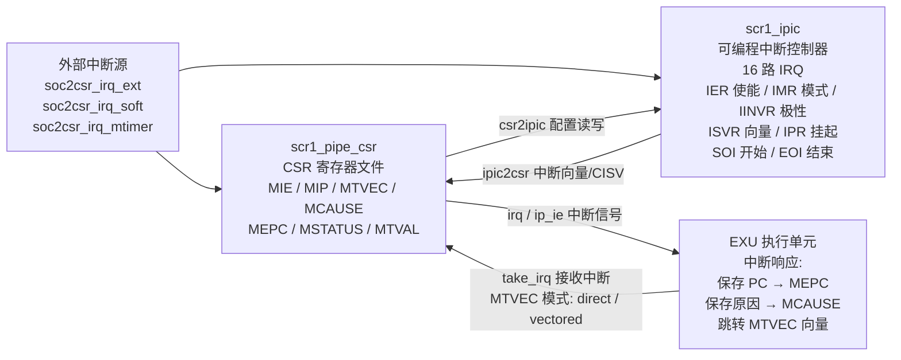

# SCR1 RISC-V 处理器 -- 模块连接关系可视化

## 图一：系统顶层架构



---

## 图二：流水线内部 -- 数据通路



---

## 图三：流水线控制流 -- 暂停 / 清空 / 跳转 / 异常



---

## 图四：调试子系统



---

## 图五：存储器系统 -- TCM + AHB 桥 + 定时器



---

## 图六：中断系统



---

## 模块间信号命名规范

所有模块间信号遵循统一格式:

```
<源模块>2<目标模块>_<信号名>_<方向后缀>
```

| 元素 | 含义 | 示例 |
|------|------|------|
| 源模块 | 信号发出方 | `exu`, `idu`, `ifu`, `mprf`, `csr`, `hdu`, `tdu`, `dmem`, `imem` |
| `2` | "to" 连接符 | -- |
| 目标模块 | 信号接收方 | `exu`, `idu`, `ifu`, `mprf`, `csr`, `hdu`, `tdu`, `dmem`, `imem` |
| `_i` 后缀 | input | 本模块视角的输入端口 |
| `_o` 后缀 | output | 本模块视角的输出端口 |

### 典型连接示例

| 信号全名 | 含义 |
|----------|------|
| `exu2ifu_pc_new_req_o` | EXU 向 IFU 发送的新 PC 请求，在 EXU 是输出 |
| `ifu2idu_instr_vd_o` | IFU 向 IDU 发送的指令有效标志，在 IFU 是输出 |
| `mprf2exu_rs1_data_o` | MPRF 向 EXU 返回的 rs1 数据，在 MPRF 是输出 |
| `csr2exu_irq_o` | CSR 向 EXU 发送的中断请求，在 CSR 是输出 |
| `hdu2exu_dbg_halted_o` | HDU 向 EXU 发送的调试暂停状态，在 HDU 是输出 |
| `dmem2lsu_rdata_i` | DMEM 向 LSU 返回的读数据，在 LSU 是输入 |

---

## 核心模块功能速查

| 模块 | 文件 | 核心功能 | 复杂度 |
|------|------|---------|--------|
| IFU | `scr1_pipe_ifu.sv` | 取指 FSM、指令队列、RVC 拼接、PC 管理 | 中 |
| IDU | `scr1_pipe_idu.sv` | RVI + RVC 译码、立即数生成、纯组合逻辑 | 中 |
| EXU | `scr1_pipe_exu.sv` | 操作数准备、异常仲裁、指令流控制、提交逻辑 | 高 |
| IALU | `scr1_pipe_ialu.sv` | 整数运算、乘除法、地址加法器、标志位 | 中 |
| LSU | `scr1_pipe_lsu.sv` | 访存 FSM、对齐检查、符号扩展、数据断点 | 低 |
| MPRF | `scr1_pipe_mprf.sv` | 2 读 1 写寄存器堆、x0 零寄存器、FPGA RAM 优化 | 低 |
| CSR | `scr1_pipe_csr.sv` | 全部 M-mode CSR、计数器、中断接口 | 高 |
| IPIC | `scr1_ipic.sv` | 16 路 IRQ 配置、向量化响应、SOI/EOI 协议 | 中 |
| HDU | `scr1_pipe_hdu.sv` | HART 调试控制、程序缓冲区执行、抽象寄存器访问 | 高 |
| TDU | `scr1_pipe_tdu.sv` | 硬件断点、指令/数据/计数触发、tdata 寄存器 | 中 |
| SCU | `scr1_scu.sv` | 系统复位生成、复位域交叉同步、粘滞状态 | 低 |
| TAPC | `scr1_tapc.sv` | JTAG TAP 16 状态 FSM、IR/DR 扫描链 | 高 |
| DMI | `scr1_dmi.sv` | JTAG ←→ DM 桥接、三字段协议 | 低 |
| DM | `scr1_dm.sv` | 调试模块、抽象命令、程序缓冲区、HART 控制 | 高 |
| TIMER | `scr1_timer.sv` | 64 位定时器、mtime/mtimecmp、时钟源选择 | 低 |
| TCM | `scr1_tcm.sv` | 紧耦合存储器、双端口 SRAM、零等待访问 | 低 |

---

生成时间: 2026-07-19
涵盖范围: SCR1 全部可综合模块及调试子系统
